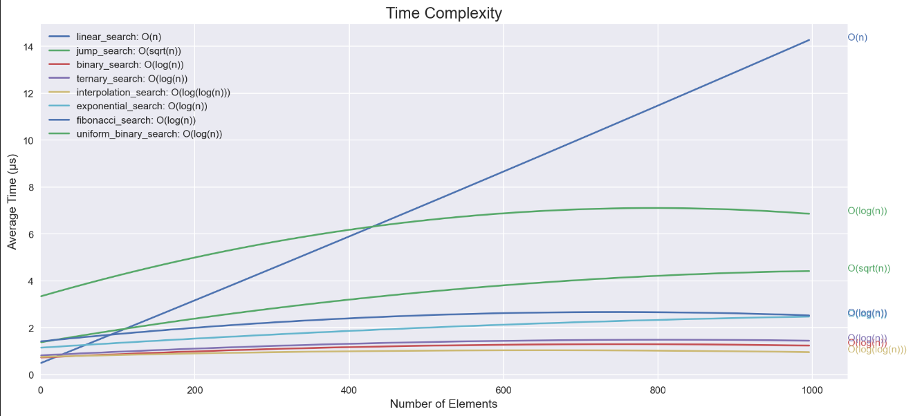

# Benchmarking Search Algorithms

This repository contains the files of my project for the Algorithm Design
Foundations course at AUT (Tehran Polytechnic).

## Studied Algorithms

1. Linear Search
2. Jump Search
3. Binary Search
4. Ternary Search
5. Interpolation Search
6. Exponential Search
7. Fibonacci Search
8. Uniform Binary Search

## Results

As we expected theoretically, we found that Linear Search has the worst
performance while Ternary Search, Binary Search, and Interpolation Search
perform the best.
