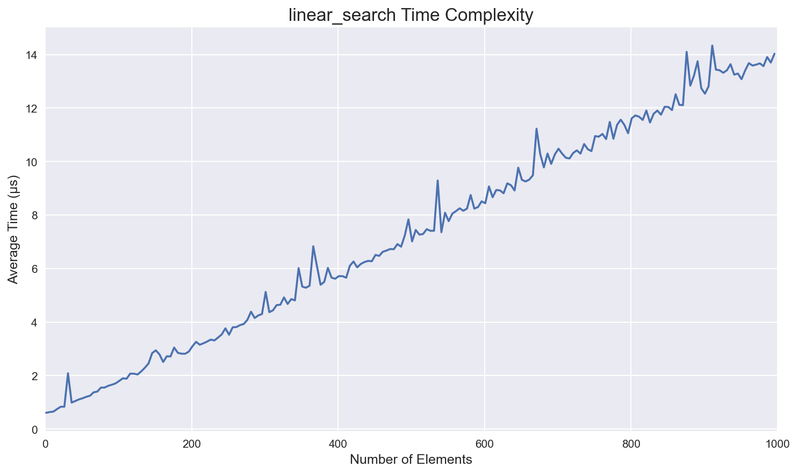
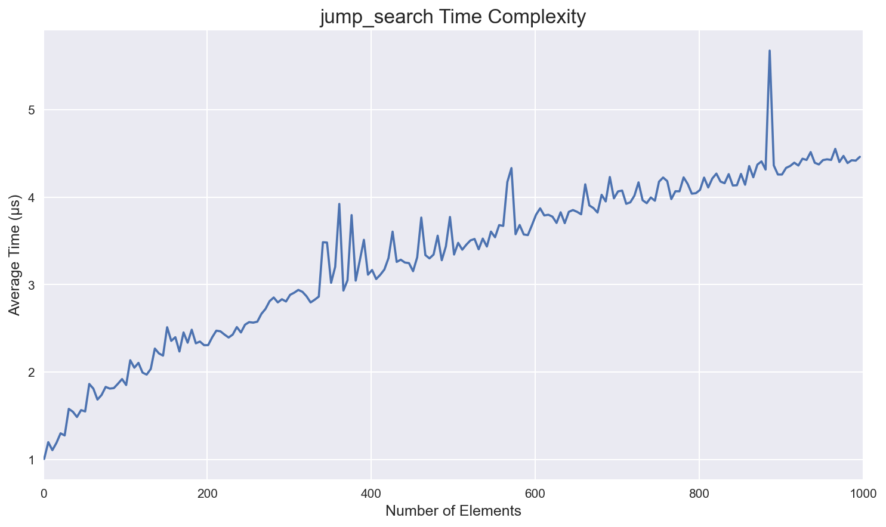
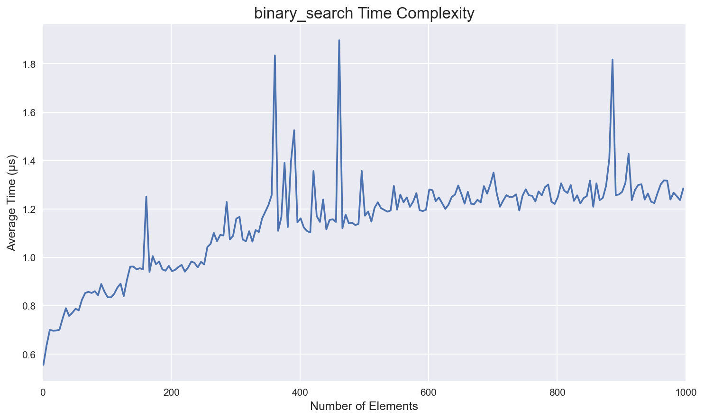
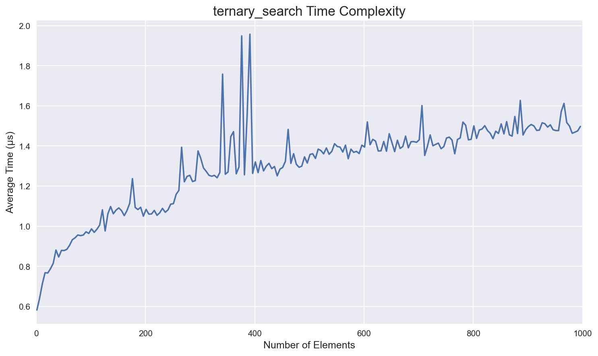
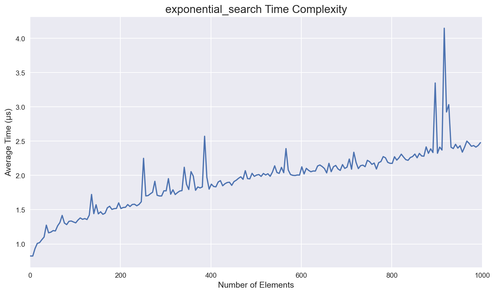
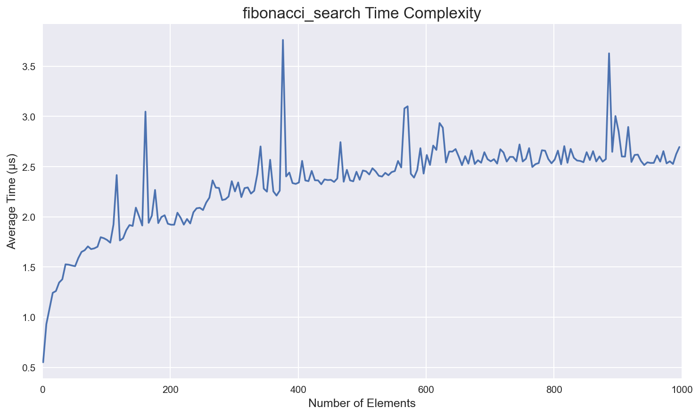
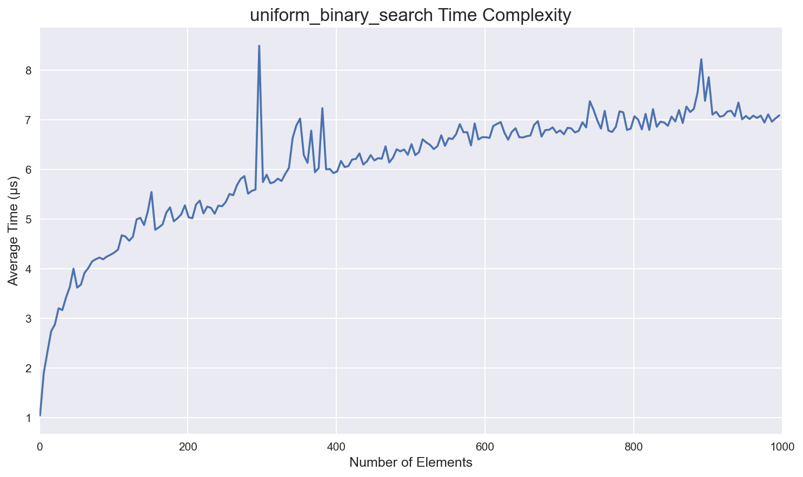
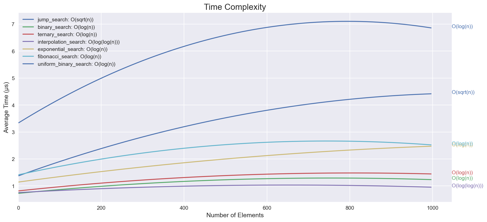

# Benchmarking Search Algorithms

This repository contains my project for the Algorithm Design Foundations course
at AUT (Tehran Polytechnic).

## Studied Algorithms

1. Linear Search
2. Jump Search
3. Binary Search
4. Ternary Search
5. Interpolation Search
6. Exponential Search
7. Fibonacci Search
8. Uniform Binary Search

## Results

As we expected theoretically, we found that Linear Search has the worst
performance. And ternary search, binary search, and interpolation search perform
the best.
