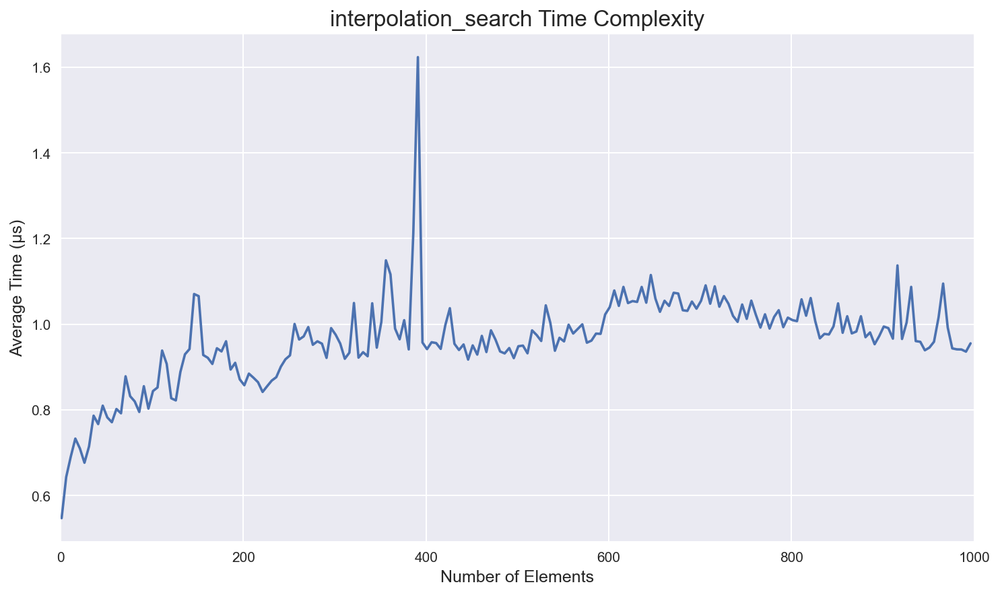

# Benchmarking Search Algorithms

This repository contains my project for the Algorithm Design Foundations course
at AUT (Tehran Polytechnic).

## Studied Algorithms

1. Linear search
2. Jump search
3. Binary search
4. Ternary search
5. Interpolation search
6. Exponential search
7. Fibonacci search
8. Uniform binary search

## Results

As we expected theoretically, we found that Linear Search has the worst
performance. And ternary search, binary search, and interpolation search perform
the best.
